# Typora使用教程

## 一、添加数学公式

### （1）、打开Typora选择数学模块

+ 点击“段落，公式块“
+ 快捷键 Ctrl+Shift+m
+ 行间公式： $ $ 公式 $$
+ 行内公式：在两个$之间

### （2）、添加数学公式

以上三种方式都能打开数学公式的编辑栏，输出美观规范的数学公式，要清楚它们的格式和代码，在编辑栏中输入代码，对应的公式会在下面实时显示.

### （3）、常用公式的代码整理

#### 1、**一些基本语法**

| 特殊字符     | 说明                                    | 实例                             | 完整字符串              |
| ------------ | --------------------------------------- | -------------------------------- | ----------------------- |
| $            | 数学公式前后加$是行内公式               | $a=x+y$                          | \$a=x+y$                |
| $$           | 数学公式加$$就是读占一行的公式          | $$a=x+y$$                        | \$\$a=x+y\$\$           |
| \            | 转义字符,特殊字符要显示原意,就在前面加\ | $\$$                             | \$\\$$                  |
| \\           | 在数学公式中是换行                      | $a=x+y\\b=y$                     | \$a=x+y\\b=y$           |
| _            | 后跟内容为下标                          | $a_i$                            | \$a_i$                  |
| ^            | 后跟内容为上标                          | $a^i$                            | \$a^i$                  |
#### 2、**分式**

| 算式            | Markdown    |
| --------------- | ----------- |
| $$1/2$$         | 1/2         |
| $$\frac{1}{2}$$ | \frac{1}{2} |

#### 3、**开根号**

| 算式                    | Markdown              |
| ----------------------- | --------------------- |
| $$\sqrt{2}$$            | \sqrt{2}              |
| $\sqrt{xy}+\sqrt[a]{x}$ | \sqrt{xy}+\sqrt[a]{x} |

#### 4、**矢量**

| 算式        | Markdown |
| ----------- | -------- |
| $$\vec{a}$$ | \vec{a}  |

#### 5、**积分**

| 算式                  | Markdown          |
| --------------------- | ----------------- |
| $$\int{x}dx$$         | \int{x}dx         |
| $$\int_{1}^{2}{x}dx$$ | \int_{1}^{2}{x}dx |
| $\oint$               | \oint             |

#### 6、**导数**

| 符号                                                         | Markdown                                                     |
| ------------------------------------------------------------ | ------------------------------------------------------------ |
| $\frac{d}{dx}\left(x^2\right) = 2x$                          | \frac{d}{dx}\left(x^2\right) = 2x                            |
| $\frac{\partial^2U}{\partial x^2} + \frac{\partial^2U}{\partial y^2}$ | \frac{\partial^2U}{\partial x^2} + \frac{\partial^2U}{\partial y^2} |

#### 7、**求模**

| 算式                 | Markdown           |
| -------------------- | ------------------ |
| $9\equiv 3 \pmod{6}$ | 9\equiv 3 \pmod{6} |

#### 8、**极限**

| 算式                           | Markdown                   |
| ------------------------------ | -------------------------- |
| $$\lim{a+b}$$                  | \lim{a+b}                  |
| $$\lim_{n\rightarrow+\infty}$$ | \lim_{n\rightarrow+\infty} |

#### 9、**累加**

| 算式                      | Markdown                |
| ------------------------- | ----------------------- |
| $$\sum{a}$$               | \sum{a}                 |
| $$\sum_{n=1}^{100}{a_n}$$ | \sum_{n=1}^{100}{a_n}   |
| $\sum\limits_{k=1}^nkx $  | \sum\limits_{k=1}^nkx   |
| $\sum\nolimits_{k=1}^nkx$ | \sum\nolimits_{k=1}^nkx |

#### 10、**累乘**

| 算式                      | Markdown              |
| ------------------------- | --------------------- |
| $$\prod{x}$$              | \prod{x}              |
| $$\prod_{n=1}^{99}{x_n}$$ | \prod_{n=1}^{99}{x_n} |

#### 11、**三角函数**

| 三角函数 | Markdown |
| -------- | -------- |
| $$\sin$$ | \sin     |

#### 12、**对数函数**

| 算式        | Markdown |
| ----------- | -------- |
| $$\ln2$$    | \ln2     |
| $$\log_28$$ | \log_28  |
| $$\lg10$$   | \lg10    |

#### 13、**关系运算符**

| 运算符     | Markdown |
| :--------- | :------- |
| $$\pm$$    | \pm      |
| $$\times$$ | \times   |
| $$\cdot$$  | \cdot    |
| $$\div$$   | \div     |
| $$\neq$$   | \neq     |
| $$\equiv$$ | \equiv   |
| $$\leq$$   | \leq     |
| $$\geq$$   | \geq     |

#### 14、**逻辑运算**

| 符号     | Markdown |
| -------- | -------- |
| $\oplus$ | \oplus   |
| $\vee$   | \vee     |
| $\wedge$ | \wedge   |

#### 15、**集合**

| 符号        | Markdown  |
| ----------- | --------- |
| $\in$       | \in       |
| $\ni$       | \ni       |
| $\subset$   | \subset   |
| $\supset$   | \supset   |
| $\subseteq$ | \subseteq |
| $\supseteq$ | \supseteq |

#### 16、**箭头**

| 符号              | Markdown        |
| ----------------- | --------------- |
| $\gets$           | \gets           |
| $\to$             | \to             |
| $\Leftarrow$      | \Leftarrow      |
| $\Rightarrow$     | \Rightarrow     |
| $\Leftrightarrow$ | \Leftrightarrow |

#### 17、**头顶符号**

| 符号       | Markdown |
| ---------- | -------- |
| $\hat{x}$  | \hat{x}  |
| $\bar{x}$  | \bar{x}  |
| $\vec{x}$  | \vec{x}  |
| $\dot{x}$  | \dot{x}  |
| $\ddot{x}$ | \ddot{x} |

#### 18、**取整函数**

| 符号      | Markdown |
| --------- | -------- |
| $\lfloor$ | \lfloor  |
| $\rfloor$ | \rfloor  |
| $\lceil$  | \lceil   |
| $\rceil$  | \rceil   |

#### 19、**希腊字母**

| 大写         | Markdown | 小写            | Markdown    |
| ------------ | -------- | --------------- | ----------- |
| $$A$$        | A        | $$\alpha$$      | \alpha      |
| $$B$$        | B        | $$\beta$$       | \beta       |
| $$\Gamma$$   | \Gamma   | $$\gamma$$      | \gamma      |
| $$\Delta$$   | \Delta   | $$\delta$$      | \delta      |
| $$E$$        | E        | $$\epsilon$$    | \epsilon    |
|              |          | $$\varepsilon$$ | \varepsilon |
| $$Z$$        | Z        | $$\zeta$$       | \zeta       |
| $$H$$        | H        | $$\eta$$        | \eta        |
| $$\Theta$$   | \Theta   | $$\theta$$      | \theta      |
| $$I$$        | I        | $$\iota$$       | \iota       |
| $$K$$        | K        | $$\kappa$$      | \kappa      |
| $$\Lambda$$  | \Lambda  | $$\lambda$$     | \lambda     |
| $$M$$        | M        | $$\mu$$         | \mu         |
| $$N$$        | N        | $$\nu$$         | \nu         |
| $$\Xi$$      | \Xi      | $$\xi$$         | \xi         |
| $$O$$        | O        | $$\omicron$$    | \omicron    |
| $$\Pi$$      | \Pi      | $$\pi$$         | \pi         |
| $$P$$        | P        | $$\rho$$        | \rho        |
| $$\Sigma$$   | \Sigma   | $$\sigma$$      | \sigma      |
| $$T$$        | T        | $$\tau$$        | \tau        |
| $$\Upsilon$$ | \Upsilon | $$\upsilon$$    | \upsilon    |
| $$\Phi$$     | \Phi     | $$\phi$$        | \phi        |
|              |          | $$\varphi$$     | \varphi     |
| $$X$$        | X        | $$\chi$$        | \chi        |
| $$\Psi$$     | \Psi     | $$\psi$$        | \psi        |
| $$\Omega$$   | \Omega   | $$\omega$$      | \omega      |

#### 20、**省略号**

| 符号         | Markdown      |
| ------------ | ------------- |
| $i\ldots{n}$ | \$i\ldots{n}$ |
| $i\cdots n$  | \$i\cdots n$  |

#### 21、**上划线**

| 符号                             | Markdown                          |
| -------------------------------- | --------------------------------- |
| $\overline{a+b}$                 | \$\overline{a+b}$                 |
| $\underline{a+b}$                | \$\underline{a+b}$                |
| $\overbrace{a+b+\dots+n}^{m个}$  | \$\overbrace{a+b+\dots+n}^{m个}$  |
| $\underbrace{a+b+\dots+n}_{m个}$ | \$\underbrace{a+b+\dots+n}_{m个}$ |

#### 22、**特殊字符**

| 符号           | Markdown   |
| -------------- | ---------- |
| $\exists$      | \exists    |
| $$\forall$$    | \forall    |
| $$\infty$$     | \infty     |
| $$\emptyset$$  | \emptyset  |
| $$\nabla$$     | \nabla     |
| $\triangle$    | \triangle  |
| $$\bot$$       | \bot       |
| $$\angle$$     | \angle     |
| $$\because$$   | \because   |
| $$\therefore$$ | \therefore |
| $\checkmark$   | \checkmark |
| $90^\circ$     | 90^\circ   |

## 二、绘制图表

### （1）基本流程图

#### **1、Graph**

关键字graph表示一个流程图的开始，同时需要指定该图的方向。例如一个从左到右的图：


流程图的定义仅由graph开始，但是方向的定义不止一种。

1. TB（ top bottom）表示从上到下
2. BT（bottom top）表示从下到上
3. RL（right left）表示从右到左
4. LR（left right）表示从左到右
5. TD与TB一样表示从上到下

#### **2、节点**

有以下几种节点和形状：

默认节点 A
文本节点 B[bname]
圆角节点 C(cname)
圆形节点 D((dname))
非对称节点 E>ename]
菱形节点 F{fname}

以上大写字母表示节点，name表示它的名字，如下图。默认节点的A同时表示该节点和它的名字，例如上图的A和B。


#### **3、连线**

节点间的连接线有多种形状，而且可以在连接线中加入标签：

1、箭头连接 A1-–>B1
2、开放连接 A2---B2
3、标签连接 A3–-text---B3 或者 A3—|text|B3
4、箭头标签连接 A4--text -->B4 或者 A4–>|text|B4
5、虚线开放连接 A5.-B5 或者 A5-.-B5 或者 A5..-B5
6、虚线箭头连接 A6.->B6 或者 A6-.->B6
7、标签虚线连接 A7-.text.-B7
8、标签虚线箭头连接 A8-.text.->B8
9、粗线开放连接 A9===B9
10、粗线箭头连接 A10==>B10
11、标签粗线开放连接 A11==text===B11

12、标签粗线箭头连接 A12==text==>B12


#### 4、使用引号抑制特殊字符

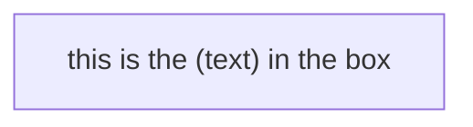

#### 5、HTML字符的转义字符

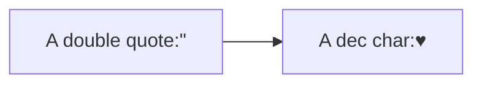

#### 6、子图

subgraph title\ 
graph definition\ 
end

示例：

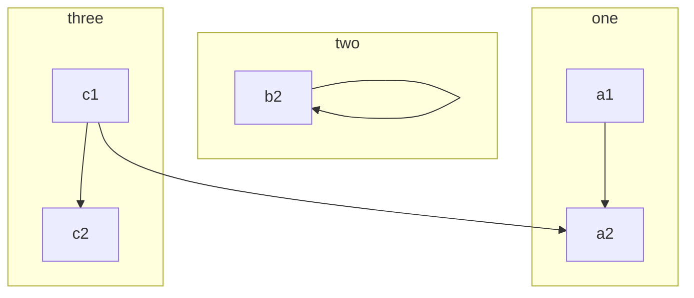

#### 7、定义样式类

- **直接使用样式**

**示例**：(注：这些样式参考CSS样式)

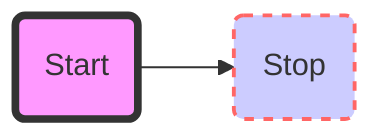

- **通过定义类来使用样式**

为了方便样式的使用，可以定义类来使用样式 
1、类的定义示例： classDef className fill:#f9f,stroke:#333,stroke-width:4px;

2、对节点使用样式类：class nodeId className;

3、同时对多个节点使用相同的样式类：class nodeId1,nodeId2 className;

4、可以在CSS中提前定义样式类，应用在图表的定义中：

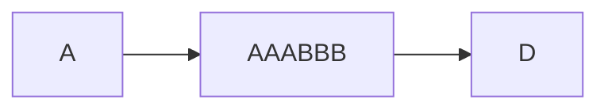

5、默认样式类：\  当没有指定样式的时候，默认采用。

classDef default  fill:#f9f,stroke:#333,stroke-width:4px;

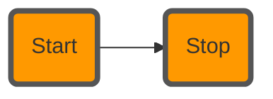

#### 8、示例：


### （2）序列图

#### **1、基本示例：**

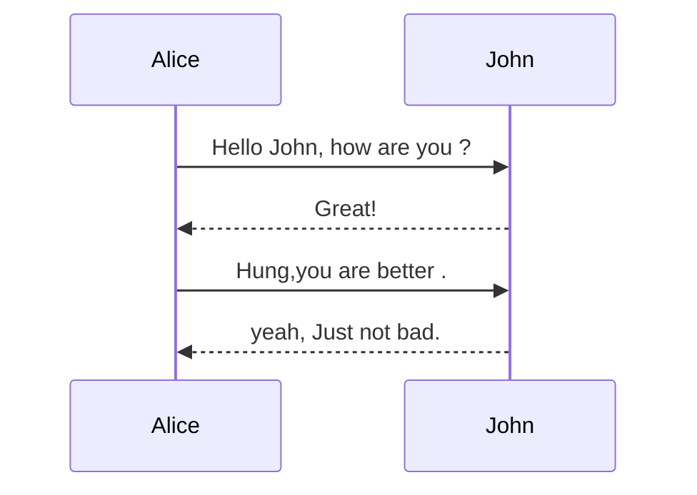

观察上面的图，如果想让John出现在前面，如何控制，mermaid通过设定参与者(participants)的顺序控制二者的顺序。上面的图可以做如下修改：

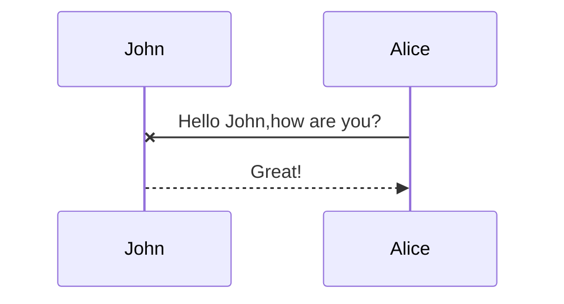

#### **2、消息的语法：**

实线或者虚线的使用：\[ Actor][Arrow]\[Actor]:Message text\ 
Arrow的六种样式：

- ->
- –>
- ->>
- –>>
- -x
- --x

示例：

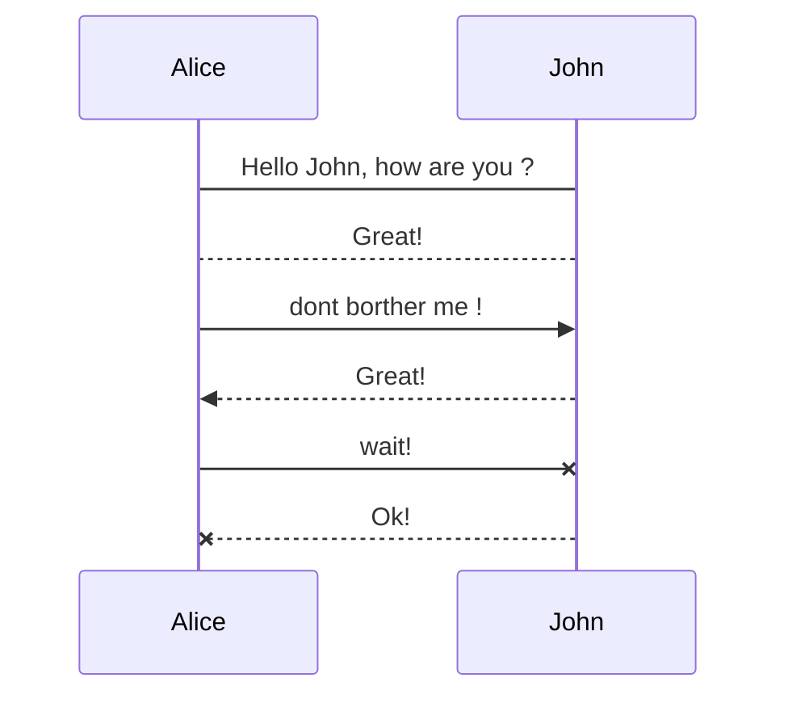

#### 3、便签

给序列图增加便签：

具体规则：Note\[right of | left of | over][Actor]:Text`

示例1：

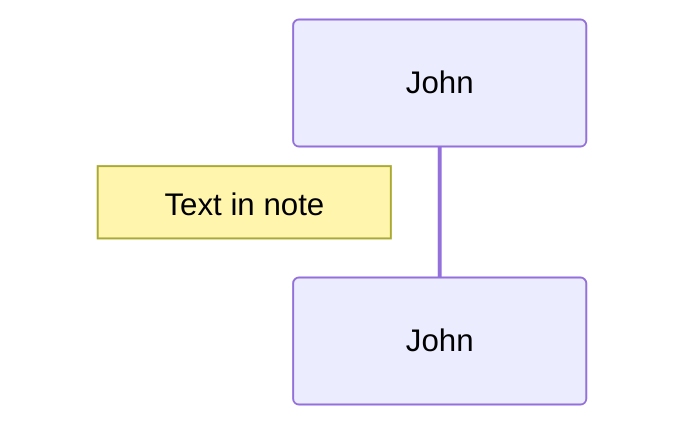

示例2：跨越两个Actor的便签

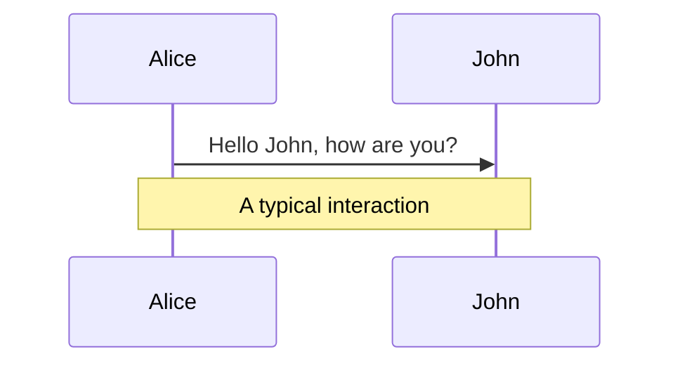

#### 4、循环Loops

loop text
... statements...
end

示例：

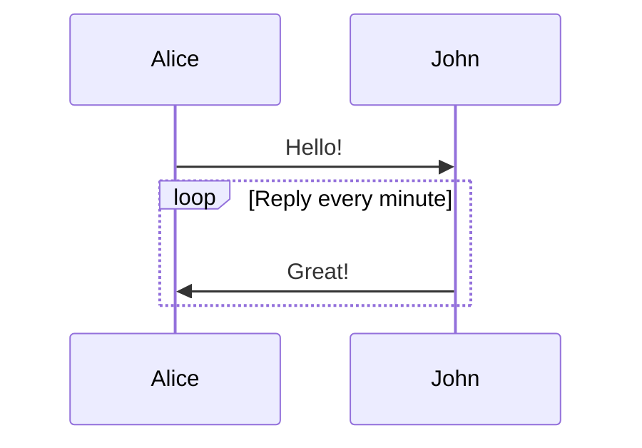

#### 5、选择ALT

在序列图中选择的表达。

规则如下：

alt Describing text
...statements...
else
...statements...
end

或者使用opt(推荐在没有else的情况下使用):

opt Describing text
...statements...
end

示例：

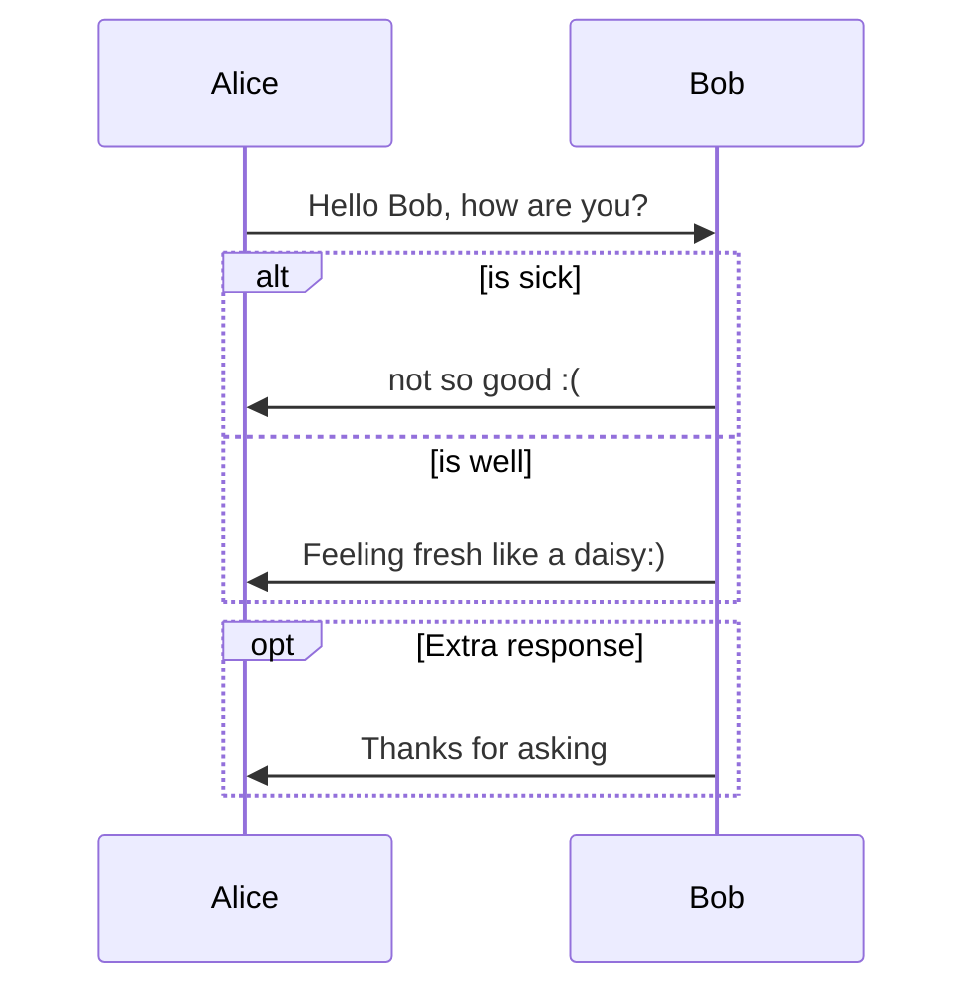

###  

### （3）甘特图

甘特图是一类条形图，由Karol Adamiechi在1896年提出, 而在1910年Henry Gantt也独立的提出了此种图形表示。通常用在对项目终端元素和总结元素的开始及完成时间进行的描述。

示例1：

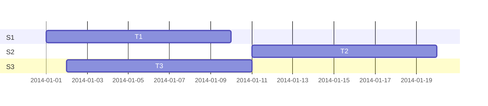

示例2：

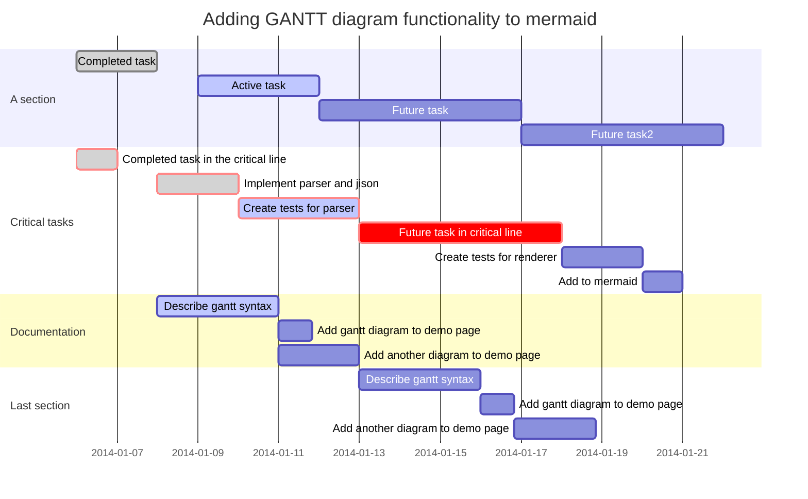

关键点：

| 关键词     | 含义               |
| ---------- | ------------------ |
| title      | 标题               |
| dataFormat | 日期格式           |
| section    | 模块               |
| Completed  | 已经完成           |
| Active     | 当前正在进行       |
| Future     | 后续待处理         |
| cirt       | 关键阶段           |
| 日期缺失   | 默认从上一项完成后 |

## 三、Typora设置

依次打开，文件——偏好设置——打开主题文件夹——找到对应主题的样式文件（如github.css），通过更改这个文件，对字体、颜色、行距等进行设置。

1、例如添加字体：

搜索“font-family”，增加 "Microsoft YaHei"，即微软雅黑字体，也可以是其他字体。

```
 font-family: "Helvetica Neue", Helvetica, Arial, sans-serif;
 font-family: "Microsoft YaHei", "Helvetica Neue", Helvetica, Arial, sans-serif;
```


2、其他设置：

line-height:15px;(控制行间距)
font-weight: bold;(控制字体加粗)
font-size: 14px;(控制字体大小)
color:#000000;(控制字体颜色)
font-family:宋体;(注明是什么字体)

3、添加其他主题

可以在官网找到一些其他主题，将下载后的主题放入步骤1的主题文件夹（文件——偏好设置——打开主题文件夹）当中即可。


**以github主题为基础的修改示例：**


```html
:root {
    --side-bar-bg-color: #d9d0bc;
    --control-text-color: #777;
}

@includewhenexporturl(https://fonts.googleapis.com/css?family=Open+Sans:400italic,700italic,700,400&subset=latin,latin-ext);

@font-face {
    font-family: 'Open Sans';
    font-style: normal;
    font-weight: normal;
    src: local('Open Sans Regular'),url('./github/400.woff') format('woff')
}

@font-face {
    font-family: 'Open Sans';
    font-style: italic;
    font-weight: normal;
    src: local('Open Sans Italic'),url('./github/400i.woff') format('woff')
}

@font-face {
    font-family: 'Open Sans';
    font-style: normal;
    font-weight: bold;
    src: local('Open Sans Bold'),url('./github/700.woff') format('woff')
}

@font-face {
    font-family: 'Open Sans';
    font-style: italic;
    font-weight: bold;
    src: local('Open Sans Bold Italic'),url('./github/700i.woff') format('woff')
}


html {
    font-size: 16px;
}

body {
    font-family: "Open Sans","Clear Sans","Helvetica Neue",Helvetica,Arial,sans-serif;
    /*color: rgb(51, 51, 51);*/
    background-color: #d9d0bc; /*body bg color*/
    line-height: 1.6;
}

#write{
    max-width: 860px;
    margin-top:    30px; /*top*/
    margin-bottom: 30px;
    padding: 100px 60px; /*top to title padding*/
    border-radius: 5px;
    -o-box-shadow: 0 10px 10px #333333;
    -webkit-box-shadow: 0 10px 10px #333333;
    -moz-box-shadow: 0 10px 10px #333333;
    box-shadow: 0px 50px 100px #333333;
}
#write > ul:first-child,
#write > ol:first-child{
    margin-top: 30px;
}

body > *:first-child {
    margin-top: 0 !important;
}
body > *:last-child {
    margin-bottom: 0 !important;
}
a {
    color: #4183C4;
}
h1,
h2,
h3,
h4,
h5,
h6 {
    position: relative;
    margin-top: 1rem;
    margin-bottom: 1rem;
    font-weight: bold;
    line-height: 1.4;
    cursor: text;
}
h1:hover a.anchor,
h2:hover a.anchor,
h3:hover a.anchor,
h4:hover a.anchor,
h5:hover a.anchor,
h6:hover a.anchor {
    /*background: url("../../images/modules/styleguide/para.png") no-repeat 10px center;*/
    text-decoration: none;
}
h1 tt,
h1 code {
    font-size: inherit;
}
h2 tt,
h2 code {
    font-size: inherit;
}
h3 tt,
h3 code {
    font-size: inherit;
}
h4 tt,
h4 code {
    font-size: inherit;
}
h5 tt,
h5 code {
    font-size: inherit;
}
h6 tt,
h6 code {
    font-size: inherit;
}
h1 {
    font-family: "PT Serif";
    padding-bottom: .3em;
    font-size: 3em;
    line-height: 1.2;
    border-bottom: 1px solid #9b9692;
    text-align: center;
}
h2 {
   padding-bottom: .3em;
    font-size: 1.75em;
    line-height: 1.225;
    border-bottom: 1px solid #9b9692;
}
h3 {
    font-size: 1.5em;
    line-height: 1.43;
}
h4 {
    font-size: 1.25em;
}
h5 {
    font-size: 1em;
}
h6 {
   font-size: 1em;
    color: #777;
}
p,
blockquote,
ul,
ol,
dl,
table{
    margin: 0.8em 0;
}
li>ol,
li>ul {
    margin: 0 0;
}
hr {
    height: 2px;
    padding: 0;
    margin: 16px 0;
    background-color: #e7e7e7;
    border: 0 none;
    overflow: hidden;
    box-sizing: content-box;
}

body > h2:first-child {
    margin-top: 0;
    padding-top: 0;
}
body > h1:first-child {
    margin-top: 0;
    padding-top: 0;
}
body > h1:first-child + h2 {
    margin-top: 0;
    padding-top: 0;
}
body > h3:first-child,
body > h4:first-child,
body > h5:first-child,
body > h6:first-child {
    margin-top: 0;
    padding-top: 0;
}
a:first-child h1,
a:first-child h2,
a:first-child h3,
a:first-child h4,
a:first-child h5,
a:first-child h6 {
    margin-top: 0;
    padding-top: 0;
}
h1 p,
h2 p,
h3 p,
h4 p,
h5 p,
h6 p {
    margin-top: 0;
}
li p.first {
    display: inline-block;
}
ul,
ol {
    padding-left: 30px;
}
ul:first-child,
ol:first-child {
    margin-top: 0;
}
ul:last-child,
ol:last-child {
    margin-bottom: 0;
}
blockquote {
    border-left: 4px solid #dfe2e5;
    padding: 0 15px;
    color: #777777;
}
blockquote blockquote {
    padding-right: 0;
}
table {
    padding: 0;
    word-break: initial;
}
table tr {
    border-top: 1px solid #dfe2e5;
    margin: 0;
    padding: 0;
    background-color: rgba(93, 172, 129, 0.2); /*若竹*/
}
table tr:nth-child(2n),
thead {
    background-color: rgba(93, 172, 129, 0.2); /*set even row color*/
}
tbody tr:nth-child(2n-1) {
    background-color: transparent !important; /*only odd row has color*/
}
table tr th {
    font-weight: bold;
    border: 1px solid #dfe2e5;
    border-bottom: 0;
    text-align: left;
    margin: 0;
    padding: 6px 13px;
}
table tr td {
    border: 1px solid #dfe2e5;
    text-align: left;
    margin: 0;
    padding: 6px 13px;
}
table tr th:first-child,
table tr td:first-child {
    margin-top: 0;
}
table tr th:last-child,
table tr td:last-child {
    margin-bottom: 0;
}

.CodeMirror-lines {
    padding-left: 4px;
}

.code-tooltip {
    box-shadow: 0 1px 1px 0 rgba(0,28,36,.3);
    border-top: 1px solid #eef2f2;
}


code {
    background-color: #f3f4f4;
    padding: 0 4px 2px 4px;
}

.md-fences {
    margin-bottom: 15px;
    margin-top: 15px;
    padding: 0.2em 1em;
    padding-top: 8px;
    padding-bottom: 6px;
}
.md-task-list-item > input {
  margin-left: -1.3em;
}

@media screen and (min-width: 914px) {
    /*body {
        width: 854px;
        margin: 0 auto;
    }*/
}
@media print {
    html {
        font-size: 13px;
    }
    table,
    pre {
        page-break-inside: avoid;
    }
    pre {
        word-wrap: break-word;
    }
}
#write pre.md-meta-block {
    padding: 1rem;
    font-size: 85%;
    line-height: 1.45;
    background-color: #f7f7f7;
    border: 0;
    border-radius: 3px;
    color: #777777;
    margin-top: 0 !important;
}
.md-fences,
code,
tt {
    /*border: 1px solid #e7eaed;*/
    background-color: rgb(197,137,88); /* code block inline BGcolor */
    border-radius: 3px;
    padding: 0;
    padding: 2px 4px 0px 4px;
    font-size: 0.8em;
    font-family: menlo;
    /*color: #f9f2f4; /*code block inline font color*/
}

.md-fences {
    background-color: #1e2128; /*code block bg color*/
    color: #989fad; /*comma*/
}
.cm-s-inner .cm-comment {color: #3f4450; /*comment color*/ }
.cm-s-inner .cm-keyword {color: #c678dd; /*function*/ }
.cm-s-inner .cm-def {color: #f9f2f4; }
.cm-s-inner .cm-operator {color: #b75bd0; } /*return var*/
.cm-s-inner .cm-variable {color: #d19a66; /*window*/ }
.cm-s-inner .cm-variable-2 { color: #e2b76a; } /*window jquery*/
.cm-s-inner .cm-string { color: #98c379; } /* string */
.cm-s-inner .cm-attribute { color: #FFCB6B; }
.cm-s-inner .cm-property { color: #d19a66; } /*property*/
.cm-s-inner .cm-variable-3 { color: #DECB6B; }
.cm-s-inner .cm-error {color: rgba(209, 154, 102, 1.0); background-color: #448867;
}
.cm-s-inner .cm-atom { color: #F77669; } /*null undefined*/
.cm-s-inner .cm-number { color: #F77669; }
.cm-s-inner .cm-builtin { color: #DECB6B; } /*system built in command*/
.cm-s-inner .cm-tag { color: #80CBC4; }  /*LaTeX command*/
.cm-s-inner .cm-meta { color: #80CBC4; } /*LaTeX command*/
.cm-s-inner .CodeMirror-matchingbracket {
  text-decoration: underline;
  color: white !important;
}

.mathjax-block>.code-tooltip {
    bottom: .375rem;
}

.md-mathjax-midline {
    background: ;
}

#write>h3.md-focus:before{
    left: -1.5625rem;
    top: .375rem;
}
#write>h4.md-focus:before{
    left: -1.5625rem;
    top: .285714286rem;
}
#write>h5.md-focus:before{
    left: -1.5625rem;
    top: .285714286rem;
}
#write>h6.md-focus:before{
    left: -1.5625rem;
    top: .285714286rem;
}
.md-image>.md-meta {
    /*border: 1px solid #ddd;*/
    border-radius: 3px;
    padding: 2px 0px 0px 4px;
    font-size: 0.9em;
    color: inherit;
}

.md-tag {
    color: #a7a7a7;
    opacity: 1;
}

.md-toc { 
    margin-top:20px;
    padding-bottom:20px;
}

.sidebar-tabs {
    border-bottom: none;
}

#typora-quick-open {
    border: 1px solid #ddd;
    background-color: #f8f8f8;
}

#typora-quick-open-item {
    background-color: #FAFAFA;
    border-color: #FEFEFE #e5e5e5 #e5e5e5 #eee;
    border-style: solid;
    border-width: 1px;
}

/** focus mode */
.on-focus-mode blockquote {
    border-left-color: rgba(85, 85, 85, 0.12);
}

header, .context-menu, .megamenu-content, footer{
    font-family: "Segoe UI", "Arial", sans-serif;
}

.file-node-content:hover .file-node-icon,
.file-node-content:hover .file-node-open-state{
    visibility: visible;
}

.mac-seamless-mode #typora-sidebar {
    background-color: #fafafa;
    background-color: var(--side-bar-bg-color);
}

.md-lang {
    color: #b4654d;
}

.html-for-mac .context-menu {
    --item-hover-bg-color: #E6F0FE;
}
```


## 四、有用的小操作

1、在内容前后分别加两个=，可以使该内容高亮，==例如== 

2、序号 :\one:   :one:    :repeat_one:  

3、插入表情    :cry: :sweat:    :happy:  :angry: ​   使用:happy:输入高兴的表情，使用:sad:输入悲伤的表情，使用:cry:输入哭的表情等。以此类推！

各种表情和符号的代码：


4、用HTML的语法 将产生下划线Underline.

5、输入~~~或者```然后回车，可以输入代码块


